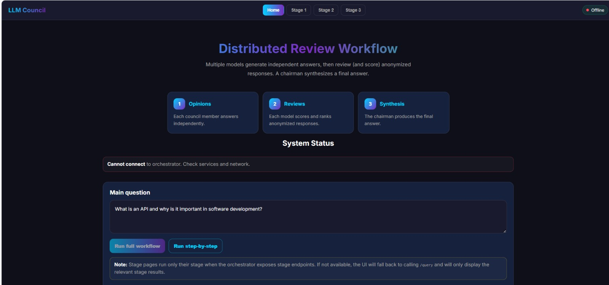
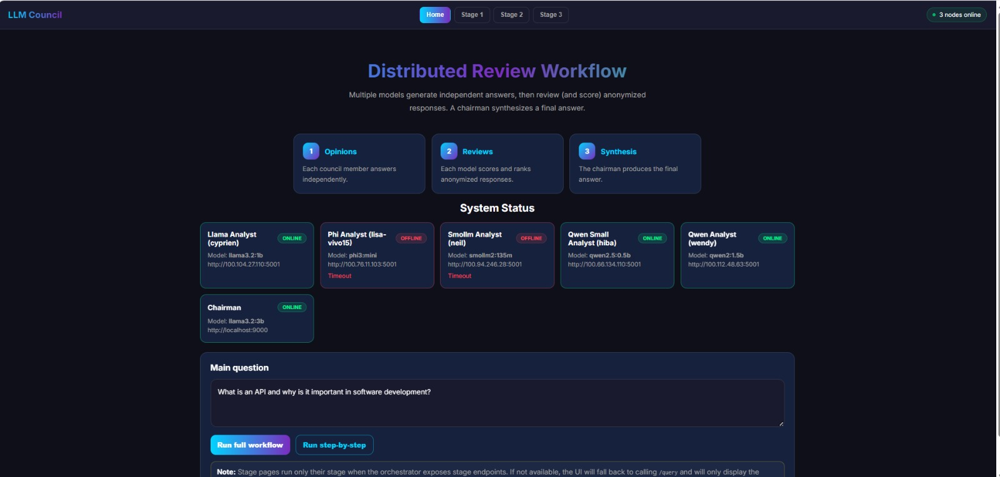
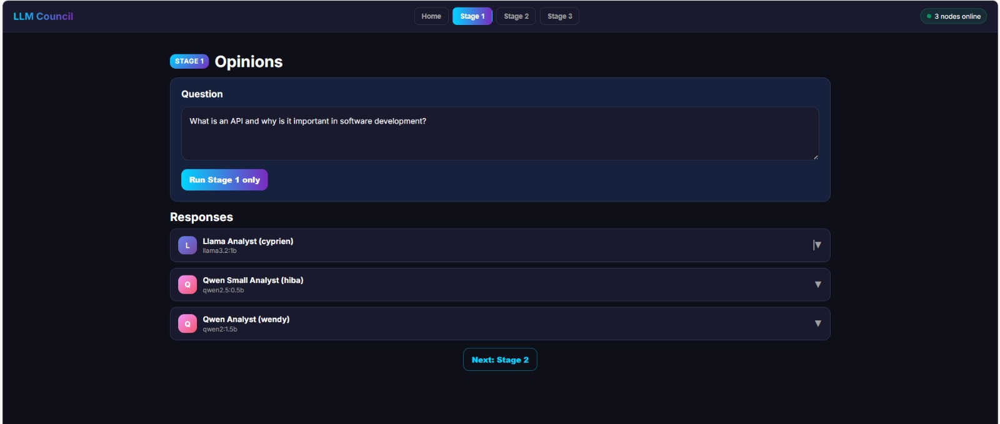
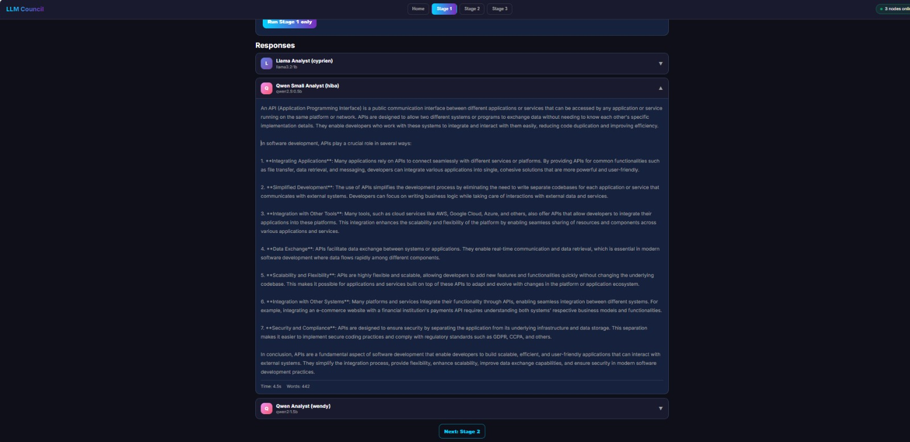
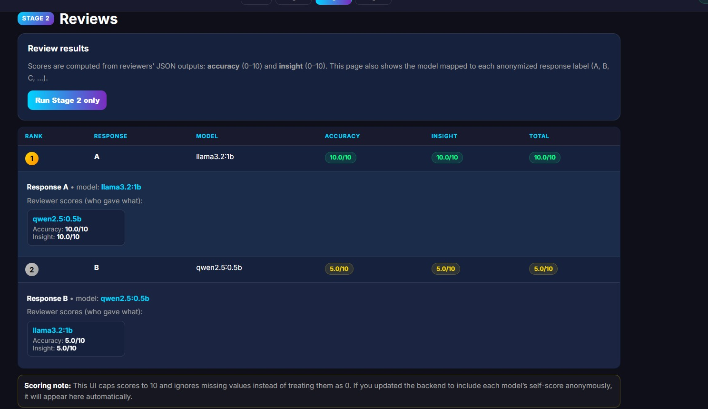
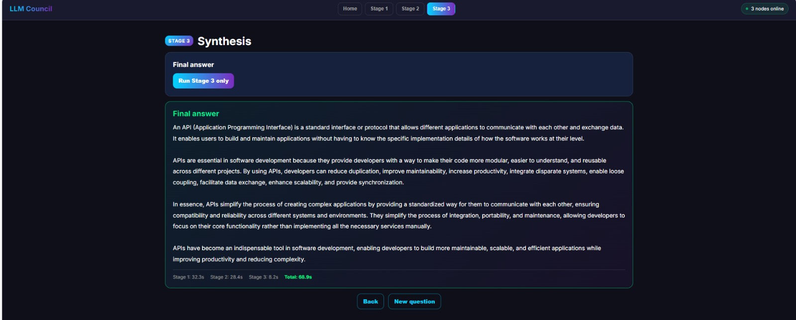
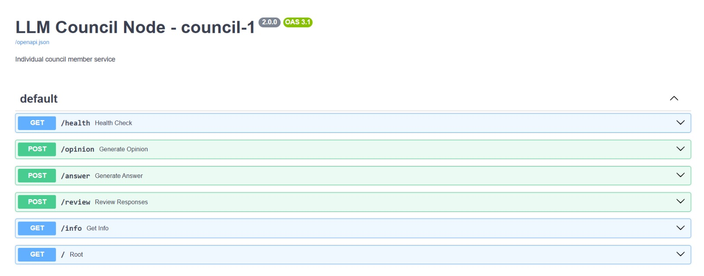
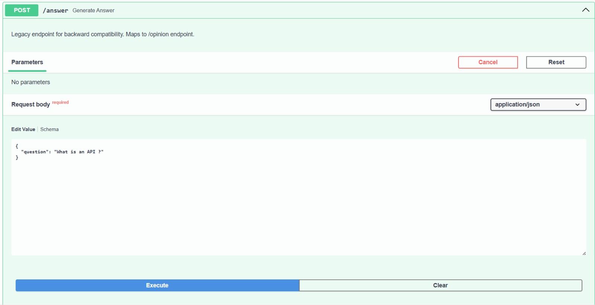
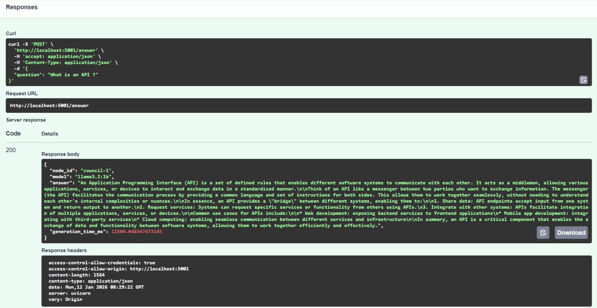
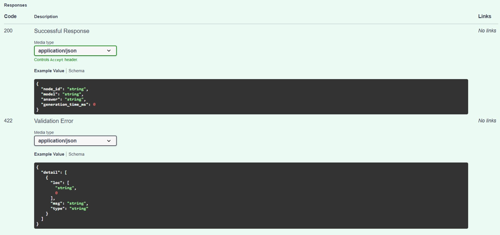

# LLM Council : Local Distributed Deployment
---

## Group Information
- **Group:** `CDOF3-A5`
- **Members:** Wendy Duong, Hiba Nejjari, Lisa Naccache, Cyprien Mouton, Neil Mahcer

---

## Table of Contents

1. [Project Summary](#project-summary)
   - [Project Overview](#project-overview)
   - [Technologies Used](#technologies-used)
   - [Workflow (Stage 1 → 2 → 3)](#workflow-stage-1--2--3)
2. [Distinction](#distinction)
   - [Services & Ports](#services--ports)
   - [Network (Tailscale)](#network-tailscale)
   - [Selected LLM Models](#selected-llm-models)
3. [Key System Features](#key-system-features)
   - [Health Monitoring & Graceful Degradation](#health-monitoring--graceful-degradation)
   - [Robust JSON Review Output (Stage 2)](#robust-json-review-output-stage-2)
   - [Response Storage](#response-storage)
   - [Frontend Integration via Static HTML](#frontend-integration-via-static-html)
4. [Improvements Over Original](#improvements-over-original)
   - [Major Improvements](#major-improvements)
5. [DEMO Screenshots](#demo-screenshots)
   - [UI — Home & System Status](#ui--home--system-status)
   - [UI — Stage 1 (Opinions)](#ui--stage-1-opinions)
   - [UI — Stage 2 (Reviews & Ranking)](#ui--stage-2-reviews--ranking)
   - [UI — Stage 3 (Chairman Synthesis)](#ui--stage-3-chairman-synthesis)
   - [Swagger — API Validation (Council Node)](#swagger--api-validation-council-node)
6. [Team Responsibilities](#team-responsibilities)
7. [Generative AI Usage Statement](#generative-ai-usage-statement)
   - [Tools & Models Used](#tools--models-used)
   - [Usage Purpose](#usage-purpose)
   - [Transparency](#transparency)

---
# Project Summary

## Project Overview
The system we put in place replaces a single-LLM pipeline with a multi-LLM collaboration, where models independently respond, critique each other’s outputs, and synthesize a final answer.
A distributed system where 5 local LLMs collaborate through a democratic 3-stage workflow: independent opinions → anonymized peer review → chairman synthesis. All models run locally via Ollama across multiple machines connected through Tailscale VPN.

## Technologies Used
- **FastAPI** - Microservices architecture (Orchestrator, Council Nodes, Chairman)
- **Ollama** - Local LLM inference 
- **Tailscale** - Secure private networking (`100.x.x.x` VPN)
- **Python 3.10+** - Backend services with Pydantic validation
- **HTML/CSS/JS** - Static frontend UI served by orchestrator

## Workflow (Stage 1 → 2 → 3)

- **3-stage democratic workflow**: Opinions → Reviews → Synthesis ensures diverse perspectives with anonymized peer evaluation
- **Model diversity**: 5 different model families (Llama, Phi, SmolLM, Qwen 0.5B-1.5B) + stronger chairman (Llama 3B) for varied reasoning
- **Graceful degradation**: System continues with minimum 2 nodes if others fail, configurable timeouts prevent blocking
- **YAML configuration**: Centralized `config.yaml` for all node URLs/models, replacing hardcoded values for easy distributed deployment
- 
In detail :


| Stage | Description | Endpoint |
|-------|-------------|----------|
| **1. First Opinions** | Each council node generates independent answer | `POST /opinion` |
| **2. Review & Ranking** | Each node reviews others' answers anonymously | `POST /review` |
| **3. Chairman Synthesis** | Chairman combines insights into final answer | `POST /synthesize` |

**Additional endpoints available:**
- `GET /health` - Check node status and Ollama connectivity
- `POST /answer` - Legacy endpoint for backward compatibility
- `GET /info` - Node metadata and configuration details
---
## Distinction :

### Services & Ports
- **Orchestrator**: `http://localhost:8080`
- **Chairman**: `http://localhost:9000`
- **Council node(s)**: `http://<node-ip>:5001` (one per machine)

### Network (Tailscale)
We used **Tailscale** to connect machines on a private network (`100.x.x.x`) without exposing ports publicly.  
We joined the same tailnet using a **team tailnet account** (common account).


### Selected LLM Models

**Council nodes** (from `config.yaml`):
- `llama3.2:1b` — Fast, good reasoning
- `phi3:mini` — Lightweight, efficient
- `smollm2:135m` — Very small, instant inference
- `qwen2.5:0.5b` — Quantized, low latency
- `qwen2:1.5b` — Balanced performance

**Chairman**:
- `llama3.2:3b` — Stronger synthesis capabilities
  
In selecting our models, our objective was to balance **speed, hardware constraints, and reasoning diversity**:

- **Small council models**: Enable fast inference on laptops, reduce request timeouts, facilitate parallelization across Stage 1 and Stage 2
- **Model diversity**: Using different families (Llama / Phi / SmolLM / Qwen) increases reasoning variety and reduces correlated errors
- **Stronger chairman**: `llama3.2:3b` improves synthesis coherence and conflict resolution across multiple opinions and reviews

---
### Key System Features

#### Health Monitoring & Graceful Degradation
- Every service exposes a `GET /health` endpoint.
- The orchestrator periodically checks each council node’s status:
  - **Reachable**: responds with HTTP 200  
  - **Offline**: marked with the failure reason (timeout, connection refused, etc.)
- A node is considered **healthy** when FastAPI is responsive and, for council nodes, Ollama is reachable with the configured model available.
- The system supports **graceful degradation**: execution continues as long as a minimum number of nodes are available, configured via  
  `fallback.min_council_members = 2`.

#### Robust JSON Review Output (Stage 2)
- During Stage 2, council nodes produce structured JSON containing:
  - `scores` for each opinion (accuracy and insight, scaled from 0 to 10)
  - A `ranking` of all anonymized opinions
- The system includes robust parsing logic that:
  - Extracts valid JSON even if surrounded by additional text
  - Normalizes missing or invalid values to the valid `[0–10]` range
- This ensures consistent and reliable evaluation despite LLM output variability.

#### Response Storage

The orchestrator stores all data **in-memory** using a Python dictionary:

```python
queries: Dict[str, QueryResponse] = {}
```

For each `query_id`, it stores:
- `opinions` — dict keyed by `node_id` (content + model + timing)
- `reviews` — dict keyed by `node_id` (JSON scores + raw output + timing)
- `final_answer` — chairman's synthesized response
- `status`, `timing`, `nodes_used`, `error` (if applicable)


But the limitation is that storage is **not persistent** : restarting the orchestrator clears all data. A production system would use a database.

---

#### Frontend Integration via Static HTML
- A lightweight static frontend is located at `frontend/index.html`.
- The orchestrator serves this UI directly using FastAPI’s `StaticFiles`.
- This approach avoids external UI frameworks (like Streamlit or Gradio) while still enabling:
  - Real-time system status monitoring
  - Execution of individual workflow stages
  - Visualization of opinions, reviews, and final synthesis

---


**Important** : See [set_up.md](./set_up.md) for setup and testing.


---

## Improvements Over Original

**Karpathy's Original**: Single-machine web app using OpenRouter API to query cloud LLMs, React frontend, FastAPI backend, JSON file storage

**Our Implementation**: Fully distributed system running local Ollama models across physical network

### Major Improvements

**1. Local Inference vs Cloud API**
- **Original**: Requires OpenRouter API key + credits, calls cloud services (GPT-5, Gemini, Claude, Grok)
- **Ours**: 100% local Ollama, zero ongoing costs, complete data privacy, works offline

**2. Distributed Architecture**
- **Original**: Single-machine deployment (frontend + backend on one computer)
- **Ours**: True distributed system across 5+ physical machines with Tailscale VPN networking

**3. Infrastructure & Deployment**
- **Original**: Simple `uv run` to start, no network complexity
- **Ours**: Real distributed infrastructure with health monitoring, LAN testing utilities, startup/shutdown scripts, firewall configuration

**4. Configuration Management**
- **Original**: Hardcoded models in `backend/config.py`
- **Ours**: Centralized `config.yaml` with per-node URLs/models, environment variable overrides, distributed deployment templates

**5. Reliability & Fault Tolerance**
- **Original**: Basic error handling for API failures
- **Ours**: Timeout protection per stage, retry logic, graceful degradation (continues with min 2 nodes), comprehensive health checks validating Ollama connectivity

**6. Service Separation**
- **Original**: Monolithic backend handles all stages
- **Ours**: Microservices architecture - separate Chairman service, independent council node services, orchestrator coordination

**7. Developer Tools**
- **Original**: Web UI only
- **Ours**: CLI test client, LAN discovery/testing scripts, automated deployment scripts, health check test suite, Swagger API documentation

**8. Model Selection Philosophy**
- **Original**: Premium cloud models (latest GPT, Gemini, Claude versions)
- **Ours**: Small efficient models (1B-3B params) optimized for consumer laptop hardware, diverse model families for reasoning variety

---


## DEMO Screenshots :

#### UI — Home & System Status



Our interface displays in real time the status of the different PCs/council nodes connected to the network: each card shows whether the node is **ONLINE** or **OFFLINE**, as well as the **Ollama model** used by the machine. If a node is unavailable, the reason is indicated. The **Chairman** status is also displayed along with its model, which makes it possible to verify that **Stage 3** can be executed.



#### UI — Stage 1 (Opinions)

The user enters a question and then clicks “Run Stage 1 only” to query each council node. Each PC/model then generates an independent response, displayed as expandable cards showing the node name and the model used. The goal is to collect multiple perspectives before moving to Stage 2, where these responses will be evaluated and ranked through peer review.






#### UI — Stage 2 (Reviews & Ranking)

After anonymizing the Stage 1 responses (labels A, B, C, …), each council node acts as a reviewer and assigns JSON-formatted scores according to two criteria: accuracy (0–10) and insight (0–10). The interface then aggregates these evaluations to compute a total score and produce a final ranking (Rank). It also shows the mapping between each anonymized label and the associated model. This mechanism makes it possible to compare the responses more objectively before the final synthesis in Stage 3.



### UI — Stage 3 (Chairman Synthesis)

When you click “Run Stage 3 only”, the orchestrator sends the question, the anonymized Stage 1 answers, and the Stage 2 reviews to the Chairman service. The Chairman then calls its Ollama model to produce a final synthesis and returns the result.



#### Swagger — API Validation (Council Node)

We used **FastAPI**, which allows us to automatically generate clear Swagger documentation for each council node. On this page, we can see all the routes exposed by **council-1**: `GET /health` to verify that the service (and Ollama on the node side) is operational, `POST /opinion` to generate the **Stage 1** response, `POST /review` to analyze and rank the anonymized responses for **Stage 2**, as well as additional endpoints such as `POST /answer` and `GET /info`. This interface was very useful for quickly testing requests, validating input/output schemas, and ensuring that the orchestrator communicates correctly with each machine.






---

---

## Team Responsibilities

| Role      | Team Member    | Machine  | Services Running                          | Responsibility                     |
| --------- | -------------- | -------- | ----------------------------------------- | ---------------------------------- |
| Student 1 | Cyprien Mouton | Laptop A | Council Node                              | Stage 1 opinions + Stage 2 reviews |
| Student 2 | Lisa Naccache  | Laptop B | Council Node                              | Stage 1 opinions + Stage 2 reviews |
| Student 3 | Neil Mahcer    | Laptop C | Council Node                              | Stage 1 opinions + Stage 2 reviews |
| Student 4 | Hiba Nejjari   | Laptop D | Orchestrator + Chairman (+ optional node) | Coordination + Stage 3 synthesis   |
| Student 5 | Wendy Duong    | Laptop E | Council Node                              | Stage 1 opinions + Stage 2 reviews |

---

## Generative AI Usage Statement

Generative AI tools (LLMs) were **explicitly allowed** for this project and were used **throughout development**.

### Tools & Models Used
- **Local LLMs** via Ollama (council & chairman models listed in configuration)
- **LLM assistants** (ChatGPT, Copilot, Claude) for engineering support and documentation

### Usage Purpose
Generative AI was applied for:
- **Debugging** (error interpretation, hypothesis generation, troubleshooting)
- **Code generation** (boilerplate, API endpoints, configuration templates)
- **Application design** decisions (architecture suggestions, workflow design, UI ideas)
- **Code refactoring** (naming, structure, readability, consistency)
- **Documentation quality** improvements

### Transparency
We declare this usage to comply with the course policy: **transparency is mandatory**.  
No attempt was made to hide LLM usage, and its role was to assist the team in development and documentation.
