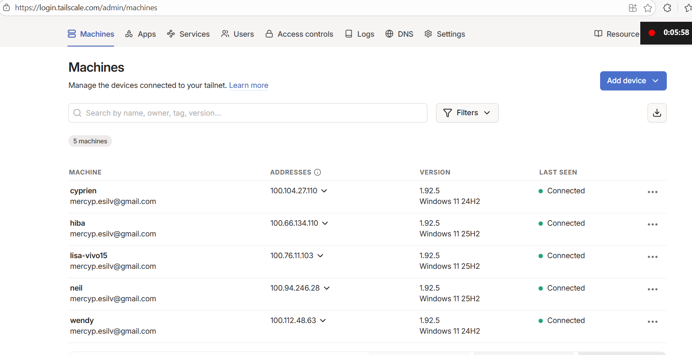

## Setup & Installation

### Prerequisites (on each machine)

1. **Python 3.10+**
2. **Ollama** installed and running locally
3. **Required LLM model** pulled (assigned in `config.yaml`):
   ```bash
   ollama pull llama3.2:1b  # Example
   ```
4. **Tailscale** installed and connected to the same account (for secure LAN communication)
   > Campus Wi-Fi blocks direct peer-to-peer connections, so Tailscale creates a private network (`100.x.x.x`)

### Install Python dependencies

From project root:

```bash
pip install -r requirements.txt
pip install fastapi uvicorn requests  # Core dependencies
```

---


## Configuration Guide

### Step 1 — Gather Network Information

On each machine, open Tailscale and note the private IP address (format: `100.x.x.x`).



### Step 2 — Configure `config.yaml`

Edit `config.yaml` with your actual machine IPs and model assignments:

```yaml
orchestrator:
  host: "0.0.0.0"
  port: 8080

council_nodes:
  - id: "council-1"
    name: "Llama Analyst (Cyprien)"
    url: "http://100.xxx.xxx.xxx:5001"  # Replace with actual Tailscale IP
    model: "llama3.2:1b"
    priority: 1
    enabled: true

  - id: "council-2"
    name: "Phi Analyst (Lisa)"
    url: "http://100.xxx.xxx.xxx:5001"
    model: "phi3:mini"
    priority: 2
    enabled: true

  - id: "council-3"
    name: "SmolLM Analyst (Neil)"
    url: "http://100.xxx.xxx.xxx:5001"
    model: "smollm2:135m"
    priority: 3
    enabled: true

  - id: "council-4"
    name: "Qwen Small Analyst (Hiba)"
    url: "http://100.xxx.xxx.xxx:5001"
    model: "qwen2.5:0.5b"
    priority: 4
    enabled: true

  - id: "council-5"
    name: "Qwen Analyst (Wendy)"
    url: "http://100.xxx.xxx.xxx:5001"
    model: "qwen2:1.5b"
    priority: 5
    enabled: true

chairman:
  id: "chairman"
  name: "Council Chairman"
  url: "http://100.xxx.xxx.xxx:9000"
  model: "llama3.2:3b"

fallback:
  min_council_members: 2
  enable_local_fallback: true
  local_model: "llama3.2:1b"

timeouts:
  health_check: 5
  opinion: 120
  review: 90
  synthesis: 180
```

---

## How to Run the Demo

### On Each Council Node Machine

1. **Start the council node service:**
   ```bat
   set NODE_ID=council-5
   set NODE_NAME=Qwen Analyst (Wendy)
   set MODEL_NAME=qwen2:1.5b
   set OLLAMA_URL=http://localhost:11434

   python -m uvicorn council_node.main:app --host 0.0.0.0 --port 5001
   ```

2. **Verify it's running:**
   ```bat
   curl http://localhost:5001/health
   ```

### On the Main Machine (Chairman + Orchestrator)

Open **two separate terminals**:

**Terminal 1 — Chairman service:**
```bat
python -m uvicorn chairman.main:app --host 0.0.0.0 --port 9000
```

**Terminal 2 — Orchestrator + UI:**
```bat
python -m uvicorn orchestrator.main:app --host 0.0.0.0 --port 8080
# Open: http://localhost:8080 in browser
```

### Using the Web UI

Once all services are running, open `http://localhost:8080` and you can:
-  Run **Stage 1** only (opinions generation)
-  Run **Stage 2** only (reviews & ranking)
-  Run **Stage 3** only (synthesis)
-  Run the **complete workflow** end-to-end
-  View node health status

---

## Testing & Verification

### Node Health Checks

After starting services, verify each node is healthy:

```bash
# Local health check (on the node machine)
curl http://localhost:5001/health

# Remote health check (from another machine)
curl http://100.xxx.xxx.xxx:5001/health
```

Expected response:
```json
{
  "status": "healthy",
  "node_id": "council-1",
  "ollama_status": "ready"
}
```

### Full System Validation Checklist

- [ ] All council nodes respond to `/health` (HTTP 200)
- [ ] All council nodes respond to `/opinion` endpoint
- [ ] All council nodes respond to `/review` endpoint
- [ ] Chairman responds to `/health` (HTTP 200)
- [ ] Chairman responds to `/synthesize` endpoint
- [ ] Orchestrator UI shows all nodes as **online**
- [ ] **Stage 1 test**: Generate opinions from all nodes
- [ ] **Stage 2 test**: Generate reviews from all nodes
- [ ] **Stage 3 test**: Generate synthesis from chairman
- [ ] **Fallback test**: Disable one node and verify system still works (requires `min_council_members: 2`)

